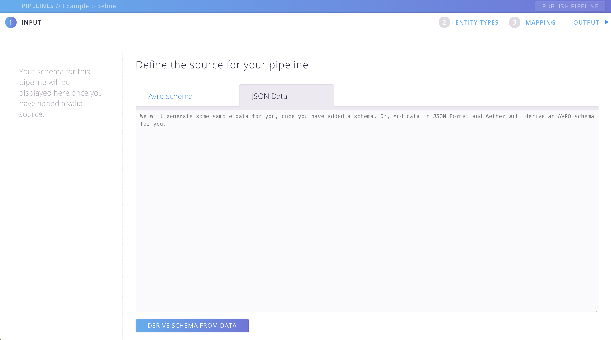
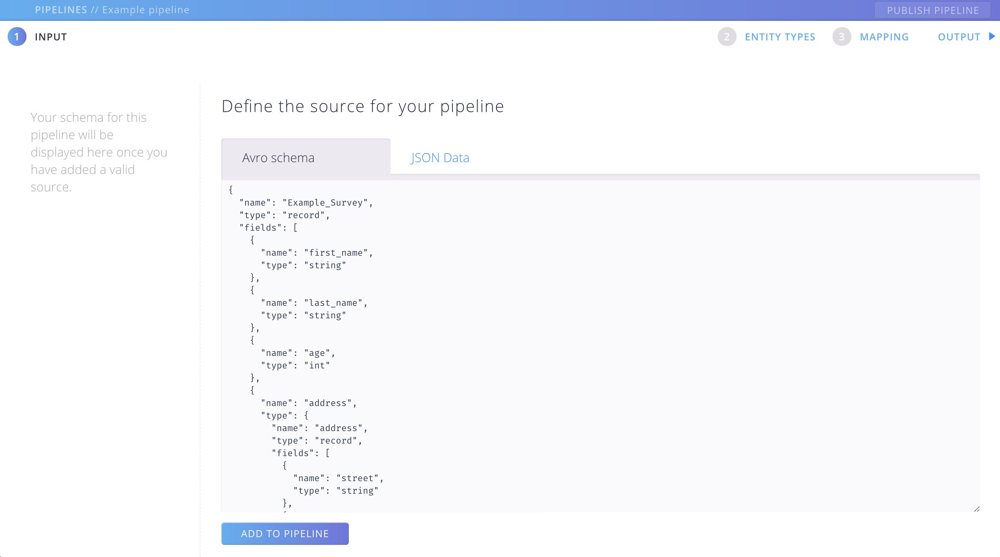
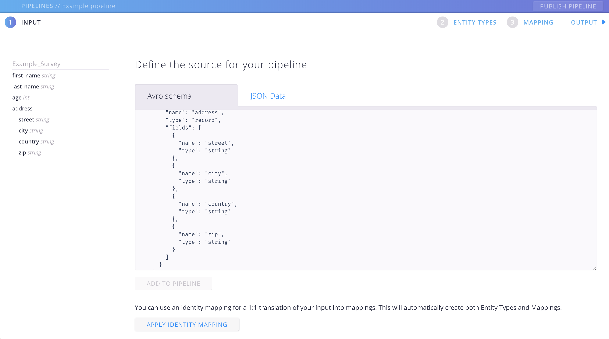
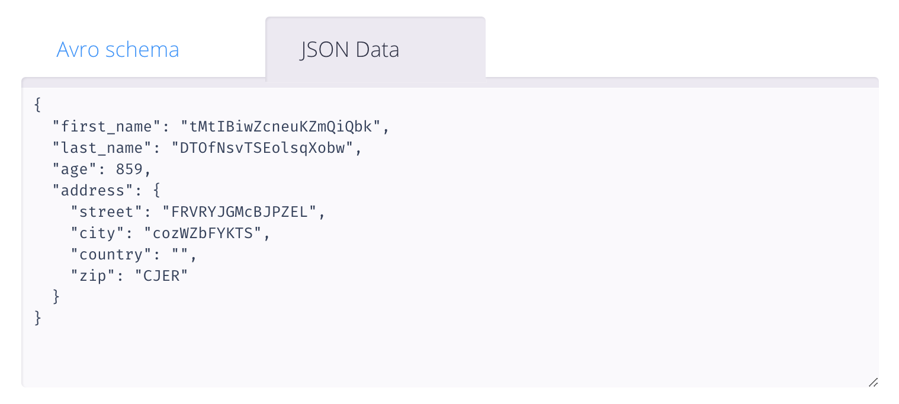
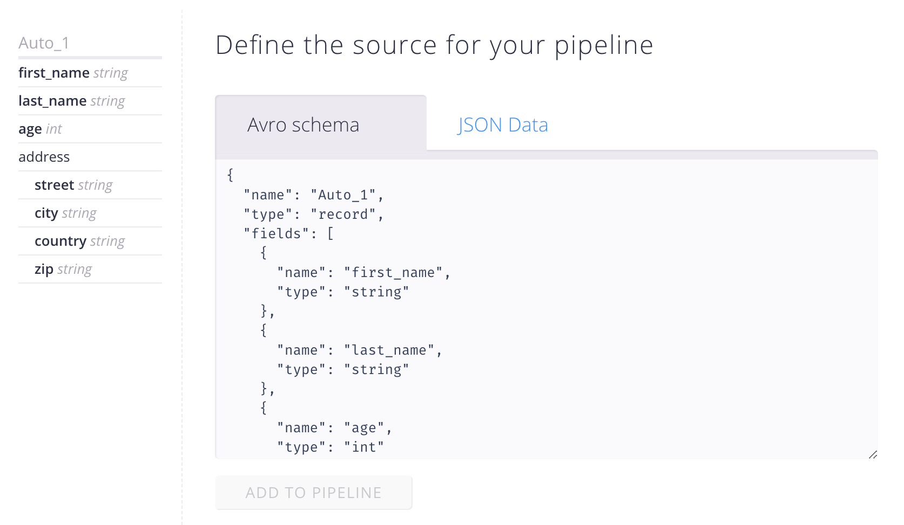

# Define the input for your pipeline

So let's get started by feeding Aether with the definition of the data you have collected, or you are about to collect.

Maybe you have conducted a survey and used some data collection tool.
Now take a piece of that data that you've gathered and let Aether derive a schema that can be used in the pipeline.

## The INPUT screen 

{: .screenshot}

Per default you will start with the Input screen, where you can define the structure of the Source you are going to use.
But you can always switch between the 3 main sections, such as INPUT, ENTITY TYPES and MAPPING.

#### There are two ways to go: 
- Either you have an **AVRO schema** that is ready to use, then continue [here](#add-an-avro-schema).
- Or, you want to use some **JSON data** as a starting point, then continue [here](#add-json-data).

## Add an AVRO schema

Switch to the "Avro schema" Tab and paste your schema into the Textarea.

{: .screenshot}

Click on "ADD TO PIPELINE". If the schema is in valid format you will see a pretty print version of your schema in the left panel. 

{: .screenshot}

When you switch over to the "JSON Data" Tab you can see that Aether created some sample data for you. This will come in handy for you, when after all you want to check the output of your pipeline.

{: .screenshot}

You can go on and modify your schema in the textarea as you like.

### That's it! You are ready to go to the next section: 
### [> Model your pipeline output](pipeline-output.html)

## Add JSON data

If you are not already there switch to the "JSON Data" Tab and paste your Json into the Textarea.

{: .screenshot}

If you click "DERIVE SCHEMA FROM DATA", Aether will automatically create an Avro schema for you. You will see a pretty print version of the derived schema in the left panel. You might as well switch to the "Avro schema" Tab and make some edits. 
For example you might want to change the generated schame name from "Auto_1" to a more meaningful name.

Handle with care! When changing the Schema it might not work any more with your collected data!
{: .hint}

{: .screenshot}

### Great, you have generated a schema from your data! Now you are ready to take the next step: 
### [> Model your pipeline output](pipeline-output.html)