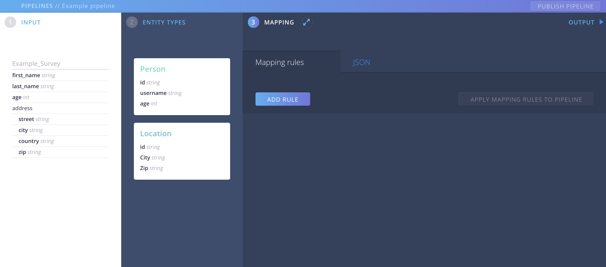
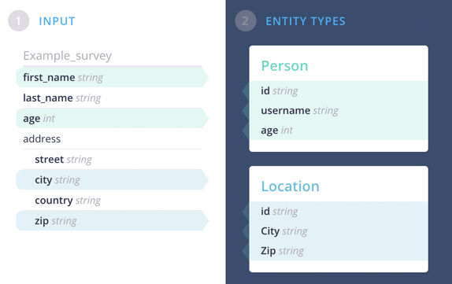
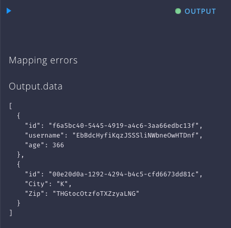

# Create a mapping

You connect the fields of your incoming data to your desired output by mapping them to the properties of your Entity Types.

In the previous two steps you have learned how to [add your input fields](pipeline-input.html) and how to [define the Entity Types](pipeline-output.html).

So now let's have a look at how to map them.

## The MAPPING screen 

{: .screenshot}

So hop over to "MAPPING" and see your Input and your Entity Types next to a list of yet empty mapping Rules.
What we want to do now, is to create a connection between fields of your input schema and properties of your Entity Types.

## Add a mapping rule

Clicking on "ADD RULE" will show you a pair of text-boxes. One for the source, and one for the destination of the mapping you want to create.

{: .screenshot}

Now check your schemas from your INPUT and your ENTITY TYPES on the left hand side. The first fields you might wanna map are `first_name` from your survey to `username` from your "Person" Entity :

To add the mapping, simply type the path of the fields into the related textboxes:

{: .screenshot}

Aether is using JsonPaths. A correct path for Entity Types consists of `EntityTypeName`.`property`.
{: .hint}

By hitting "APPLY MAPPING RULES TO PIPELINE" you can see the result of your action: The first mapping is created!

{: .screenshot}

The mapped fields have a different background now.

## Check the Output

{: .screenshot}

Noticed the red dot next to "OUTPUT"?

Aether actually processes the pipeline now, since you have applied a mapping. But it is failing. Why?

Because a Person consists of `id`, `username` and `age`. Our output would be a Person with `username` only, which is not what the extracted record expects.

## More mappings

So let's go back to the MAPPING screen and add another rule for the property `id`.

{: .screenshot}

Remember as [we've explained earlier](pipeline-output#add-an-entity-type), that each Entity Type must have an ID? This is mandatory for every Mapping.
{: .hint}

Since we haven't got an ID that comes with the input source, we can create one by using `#!uuid`. This will generate a Universally unique identifier.

We can continue now adding all the mappings we need for our Entity Types:

{: .screenshot}

See how all the the mappings are marked now:

{: .screenshot}

## The Output

If you click to open the OUTPUT panel, you can see the data, that was generated from your mappings.

{: .screenshot}

Great job!

The output has switched to display a green light:
This pipeline now produces two Entities from your Input.

### We are almost finished! Just one last step: 
### [> Publish the pipeline](pipeline-publish.html)
