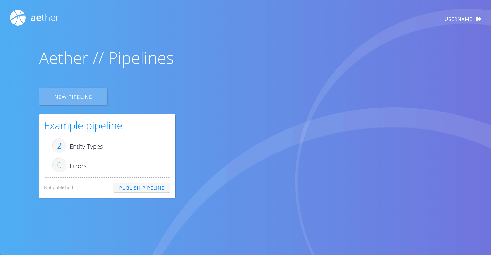
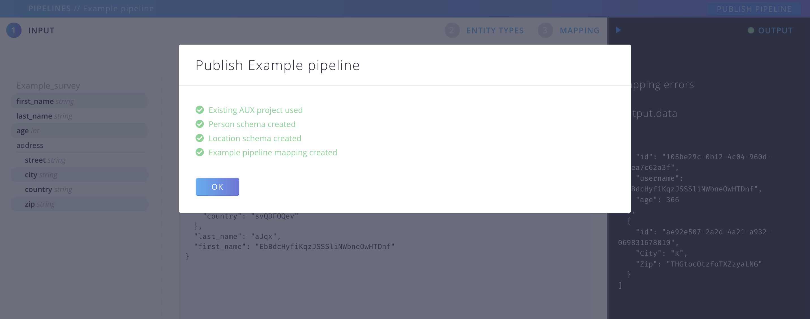
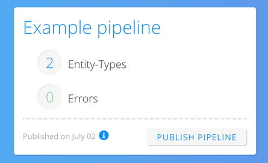

# Publish your pipeline

Once you are done with your pipeline, you want it to take effect on your data submissions.

Up to now all the configurations you have made were private. You have used some sample data to validate your mappings, but you actually need to push your Entity Types and Mappings to the Aether Kernel in order to start the process of Entity Extraction of real Data.

## Check your Output 

You cannot publish your pipeline with Errors. So make sure everything is as it ought to be. When there's green light you can push the button "PUBLISH PIPELINE" in the top bar.

{: .screenshot}

You can also publish a pipeline from the Pipelines Overview:

{: .screenshot}

## Publish 

A few moments after you clicked on "PUBLISH PIPELINE", your project with all its schemas and mappings will be created on kernel:

{: .screenshot}

In the pipelines Overview you can see the information on your last publish. 

{: .screenshot}

Clicking on the small "i" icon let's you see the details of that action. You can find your Submission url there:

{: .screenshot}

### That was it!

If you have any questions, please don't hesitate to [contact](mailto:solutions@ehealthafrica.org)
us.
